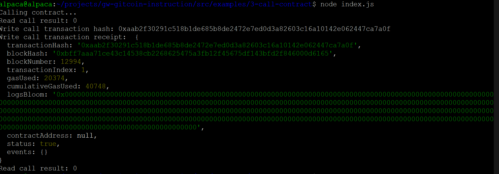

# Nervos Hackathon task 3

Contract call Screenshot: 

tx hash: 0xaab2f30291c518b1de685b8de2472e7ed0d3a82603c16a10142e062447ca7a0f

Contract address: 0xf1290b43e657C71dd9fB4b8F6d565Ad19213ac13

ABI: 
```json
[
    {
        "inputs": [],
        "stateMutability": "payable",
        "type": "constructor"
    },
    {
        "inputs": [
            {
                "internalType": "uint256",
                "name": "x",
                "type": "uint256"
            }
        ],
        "name": "set",
        "outputs": [],
        "stateMutability": "payable",
        "type": "function"
    },
    {
        "inputs": [],
        "name": "get",
        "outputs": [
            {
                "internalType": "uint256",
                "name": "",
                "type": "uint256"
            }
        ],
        "stateMutability": "view",
        "type": "function"
    }
]

```
