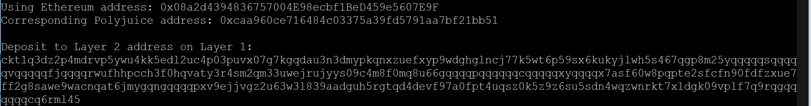

# Nervos Hackathon task 6

Deposit receiver address: 

ckt1q3dz2p4mdrvp5ywu4kk5edl2uc4p03puvx07g7kgqdau3n3dmypkqnxzuefxyp9wdghglncj77k5wt6p59sx6kukyjlwh5s467qgp8m25yqqqqqsqqqqqvqqqqqfjqqqqrwufhhpcch3f0hqvaty3r4sm2qm33uwejrujyys09c4m8f0mq8u66gqqqqpqqqqqqcqqqqqxyqqqqx7asf60w8pqpte2sfcfn90fdfzxue7ff2g8sawe9wacnqat6jmygqngqqqqpxv9ejjvgz2u63w3l839aadguh5rgtqd4devf97a0fpt4uqsz0k5z9z6su5sdn4wqzwnrkt7xldgk09vplf7q9rqgqqqqqqcq6rml45

Ethereum address: 0x08a2d4394836757004E98ecbf1BeD459e5607E9F

Etherscan bridge transaction: https://rinkeby.etherscan.io/tx/0xb8e099b552daaf37f6c22a6f73d1af74bba4aebd0aa746a600d4bf5507ebdb32

Nervos bridge transaction: https://explorer.nervos.org/aggron/transaction/0x3bad0d825bea28979f3a39d9a7e1711c9837ba79a55cec6ff0029621c2cf93d6
